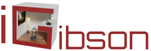

#  iGibson: the Interactive Gibson Environment

  

### Large Scale Interactive Simulation Environments for Robot Learning

iGibson, the Interactive Gibson Environment, is a simulation environment providing fast visual rendering and physics simulation (based on Bullet). It is packed with a dataset with hundreds of large 3D environments reconstructed from real homes and offices, and interactive objects that can be pushed and actuated. iGibson allows researchers to train and evaluate robotic agents that use RGB images and/or other visual sensors to solve indoor (interactive) navigation and manipulation tasks such as opening doors, picking and placing objects, or searching in cabinets.

### Latest Updates
[05/14/2020] Added dynamic light support :flashlight:

[04/28/2020] Added support for Mac OSX :computer:

### Citation
If you use iGibson or its assets and models, consider citing the following publication:

```
@article{xia2020interactive,
         title={Interactive Gibson Benchmark: A Benchmark for Interactive Navigation in Cluttered Environments},
         author={Xia, Fei and Shen, William B and Li, Chengshu and Kasimbeg, Priya and Tchapmi, Micael Edmond and Toshev, Alexander and Mart{\'\i}n-Mart{\'\i}n, Roberto and Savarese, Silvio},
         journal={IEEE Robotics and Automation Letters},
         volume={5},
         number={2},
         pages={713--720},
         year={2020},
         publisher={IEEE}
}
```


### Release
This is the repository for iGibson (gibson2) 0.0.4 release. Bug reports, suggestions for improvement, as well as community developments are encouraged and appreciated. The support for our previous version of the environment, [Gibson v1](http://github.com/StanfordVL/GibsonEnv/), will be moved to this repository.

### Documentation
The documentation for this repository can be found here: [iGibson Environment Documentation](http://svl.stanford.edu/igibson/docs/). It includes installation guide (including data download), quickstart guide, code examples, and APIs.

If you want to know more about iGibson, you can also check out [our webpage](http://svl.stanford.edu/igibson), [our RAL+ICRA20 paper](https://arxiv.org/abs/1910.14442) and [our (outdated) technical report](http://svl.stanford.edu/igibson/assets/gibsonv2paper.pdf).

### Dowloading Dataset of 3D Environments
There are several datasets of 3D reconstructed large real-world environments (homes and offices) that you can download and use with iGibson. All of them will be accessible once you fill in this [form](https://forms.gle/36TW9uVpjrE1Mkf9A).

You will have access to ten environments with annotated instances of furniture (chairs, tables, desks, doors, sofas) that can be interacted with, and to the original 572 reconstructed 3D environments without annotated objects from [Gibson v1](http://github.com/StanfordVL/GibsonEnv/).

You will also have access to a [fully annotated environment: Rs_interactive](https://storage.googleapis.com/gibson_scenes/Rs_interactive.tar.gz) where close to 200 articulated objects are placed in their original locations of a real house and ready for interaction. ([The original environment: Rs](https://storage.googleapis.com/gibson_scenes/Rs.tar.gz) is also available). More info can be found in the [installation guide](http://svl.stanford.edu/igibson/docs/installation.html).

# VR Information

Instructions for installing Gibson and VR integration on Windows 10.
Assuming a fresh install of Windows.

These instructions partially overlap with installing Gibson
http://svl.stanford.edu/gibson2/docs/installation.html#installation-method 
but are tailored to run the VR components in Windows.


VR Station
==========

Install Steam and Steam VR, connect VR headset and base stations, set up VR room
Run steam performance test.

https://www.vive.com/eu/support/vive/category_howto/setting-up-for-the-first-time.html


Dependencies and environment:
=============================

* git 
https://git-scm.com/download/win

* Python
https://www.python.org/downloads/release/python-377/

* Anaconda 
https://www.anaconda.com/distribution/#download-section

Make sure anaconda is added to the PATH as follows:
C:\Users\C\anaconda3
C:\Users\C\anaconda3\Scripts
C:\Users\C\anaconda3\Library\bin

Lack of the latter produced the following error:
HTTP 000 CONNECTION FAILED for url <https://repo.anaconda.com/pkgs/main/win-64/current_repodata.json> Elapsed

* Build Tools for Visual Studio:
Microsoft Visual C++ 14.0 is required. Get it with "Build Tools for Visual Studio": 
https://visualstudio.microsoft.com/downloads/
This is needed for bullet

* cmake:
https://cmake.org/download/
Needed for building MeshRendererContext and Pybind.

* SRAnipal (needed for eye tracking):
https://hub.vive.com/en-US/download

Download the VIVE_SRanipalInstaller msi file and install SRAnipal.

Gibson
======

* Get codebase and assets:

```
$ git clone https://github.com/fxia22/iGibson.git --recursive
$ cd iGibson
$ git checkout vr
$ git submodule update --recursive
```

Download Gibson assets and copy to iGibson/gibson2/assets/
Download enviroments (scenes) and copy to iGibson/gibson2/assets/dataset

* Create anaconda env:

```
$ conda create -n gibsonvr python=3.6
```
Activate conda env:
```
$ source activate gibsonvr
```

* Install Gibson in anaconda env:
```
$ cd iGibson
```
- If you followed the instructions, iGibson is at the vr branch
```
$ pip install -e .
```

Should end printing 'Successfully installed gibson2'

* Copy dlls into the mesh_renderer/Release folder:
Copy and paste the following dll files into iGibson/gibson2/render/mesh_renderer/Release:
1) openvr_api.dll in render/openvr/bin/win64
2) All the dll files in render/sranipal/bin

You can find all the VR demos iGibson/examples/demo

Run:

$ python vr_demo_hand.py (for a scene with an interactive hand)

or 

$ python vr_demo_rs.py (for the current state-of-the-art Gibson graphics)

To see the features of the VR software.

To use the gripper asset featured in the interaction demos, please download the 'gripper' folder at this link: https://drive.google.com/drive/folders/1-lHTtUuEgs9zzcievvvVdjHP0BdN7Du4?usp=sharing, and put it in assets/models (wherever your assets folder is).

To use the VR hand asset, please download and unzip the asset and put it into assets/models under the folder name 'vr_hand'.
Link to VR hand: https://drive.google.com/file/d/117qb1r_YHHVdQuwLD83N_nd0la57j9hZ/view?usp=sharing

Have fun in VR!

Helpful tips:
Press ESCAPE to force the fullscreen rendering window to close during program execution.
Before using SRAnipal eye tracking, you may want to re-calibrate the eye tracker. Please go to the Vive system settings to perform this calibration.