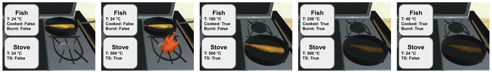
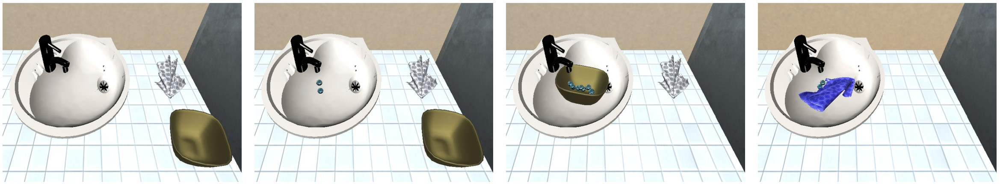
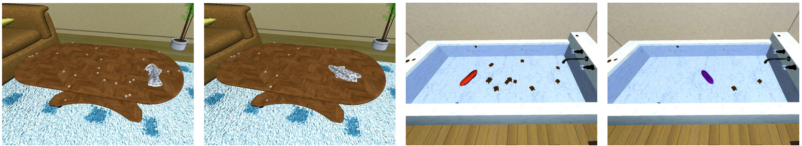
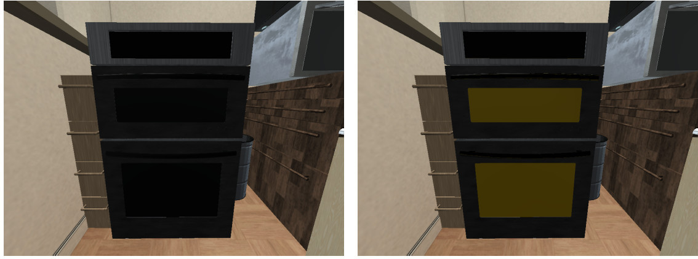
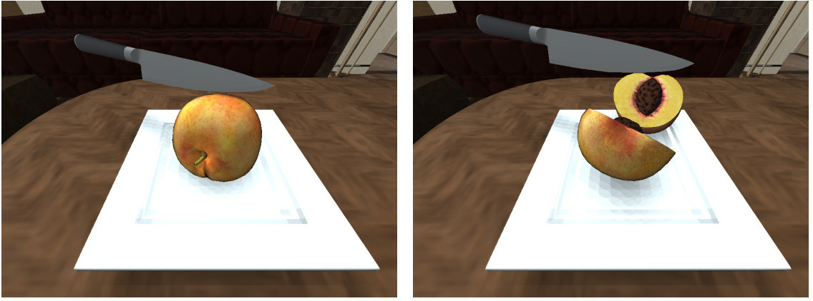

# Extended States and Logic States

### Extended States

iGibson 2.0 is an object-oriented simulator: the simulator maintains and updates a list of objects with properties that change over-time.
Object classes are organized following the WordNet hierarchy.
Different to other simulators, iGibson 2.0 is not limited to kinematic properties of the objects (pose, velocity, acceleration, joint configurations for articulated objects), but it includes also a set of additional object-properties that we call "extended states".
The extended states are:

#### Temperature 

Real continuous value per object. It can change if the object is close/inside a source or sink of heat, and the source/sink is active.

#### Wetness level

Integer value per object. It changes when in contact with a water dropplet.

#### Cleanliness (Dustiness and Stain Level) 

In iGibson 2.0, objects can be initialized with visible dust or stain particles on its surface. The number of particles at initialization corresponds to a 100% level of dustiness, d, or stains, s, as we assume that dust/stain particles cannot be generated after initialization. As particles are cleaned, the level decreases proportionally to the number of particles removed, reaching a level of 0% when all particles have been cleaned.

#### Toggled State 
Some object categories in iGibson 2.0 can be toggled on and off. iGibson 2.0 maintains and updates an internal binary functional state for those objects.

#### Sliced State 
Many cooking activities require the agent to slice objects, e.g. food items. 
In iGibson 2.0 some objects can be sliced into two halves and the state of the object will be updated.

## Logic States

Based on the kinematic and extended states, iGibson 2.0 implements a list of logic predicates, checking conditions to indicate if a logic state is True or False.
The logic states implemented and checked by iGibson 2.0 include:
- InsideOf(o1,o2): Object o1 is inside of object o2 if we can find two orthogonal axes crossing at o1 center of mass that intersect o2 collision mesh in both directions.
- OnTopOf(o1,o2): Object o1 is on top of object o2 if o2 is in the list of objects InSameNegativeVerticalAxisObjs(o1) and o2 is in the list of objects InSamePositiveVerticalAxisObjs(o1) and InContactWith(o1, o2), where InSamePositive/NegativeVerticalAxisObjs(o1) is the list of objects in the same positive/negative vertical axis as o1 and InContactWith(o1, o2) is whether the two objects are in physical contact.
- NextTo(o1,o2): Object o1 is next to object o2 if o2 is in the list of objects InSameHorizontalPlaneObjs(o1) and l2(o1, o2) < tNextTo , where InSameHorizontalPlaneObjs(o1) is a list of objects in the same horizontal plane as o1, l2 is the L2 distance between the closest points of the two objects, and tNextTo is a distance threshold that is proportional to the average size of the two objects.
- InContactWith(o1,o2): Object o1 is in contact with o2 if their surfaces are in contact in at least one point, i.e., o2 is in the list of objects InContactObjs(o1).
- Under(o1,o2): Object o1 is under object o2 if o2 is in the list of objects InSamePositiveVerticalAxisObjs(o1) and o2 6 is in the list of objects InSameNegativeVerticalAxisObjs(o1).
- OnFloor(o1,o2): Object o1 is on the room floor o2 if InContactWith(o1, o2) and o2 is of Room type.
- Open(o): Any joints (internal articulated degrees of freedom) of object o are open. Only joints that are relevant to consider an object Open are used in the predicate computation, e.g. the door of a microwave but not the buttons and controls. To select the relevant joints, object models of categories that can be Open undergo an additional annotation that produces a RelevantJoints list. A joint is considered open if its joint state q is 5% over the lower limit, i.e. q > 0.05(qUpperLimit − qLowerLimit ) + qLowerLimit.
- Cooked(o): The temperature of object o was over the cooked threshold, Tcooked , and under the burnt threshold, Tburnt, at least once in the history of the simulation episode, i.e., Tcooked ≤ T max o < Tburnt. We annotate the cooked temperature Tcooked for each object category that can be Cooked.
- Burnt(o): The temperature of object o was over the burnt threshold, Tburnt, at least once in the history of the simulation episode, i.e., T max o ≥ Tburnt. We annotate the burnt temperature Tburnt for each object category that can be Burnt.
- Frozen(o): The temperature of object o is under the freezing threshold, Tfrozen , i.e., To ≤ Tfrozen . We assume as default freezing temperature Tfrozen = 0◦C, a value that can be adapted per object category and model.
- Soaked(o): The wetness level w of the object o is over a threshold, wsoaked , i.e., w ≥ wsoaked . The default value for the threshold is wsoaked = 1, (the object is soaked if it absorbs one or more droplets), a value that can be adapted per object category and model.
- Dusty(o): The dustiness level d of the object o is over a threshold, ddusty , i.e., d > ddusty . The default value for the threshold is ddusty = 0.5, (half of the dust particles have been cleaned), a value that can be adapted per object category and model.
- Stained(o): The stain level s of the object o is over a threshold, sstained , i.e., s > sstained . The default value for the threshold is sstained = 0.5, (half of the stain particles have been cleaned), a value that can be adapted per object category and model.
- ToggledOn(o): Object o is toggled on or off. It is a direct query of the iGibson 2.0 objects’ extended state TS, the toggled state.
- Sliced(o): Object o is sliced or not. It is a direct access of the iGibson 2.0 objects’ extended state SS, the sliced state.
- InFoVOfAgent(o): Object o is in the field of view of the agent, i.e., at least one pixel of the image acquired by the agent’s onboard sensors corresponds to the surface of o.
- InHandOfAgent(o): Object o is grasped by the agent’s hands (i.e. assistive grasping is activated on that object).
- InReachOfAgent(o): Object o is within dreach = 2 meters away from the agent.
- InSameRoomAsAgent(o): Object o is located in the same room as the agent.

We do not annotate all objects all extended states.
Objects are annotated with extended states that allow to query meaningful and useful logic states from them, e.g. temperature to query if food is cooked (or frozen or burned).
This doesn't mean a table does not have temperature, but it is not relevant for most robotics activities simulated in iGibson 2.0.
We annotate object classes with meaningful logic states that apply to them, and, possibly, the parameters to check these states.
The list of classes and states can be found in the BDDL repository ([list of object characteristics](https://github.com/sanjanasrivastava/BDDL/blob/master/utils/synsets_to_filtered_properties_pruned_igibson.json)).

The characteristics that can be annotated include (additional extended state and parameters in parenthesis):
 (e.g., the temperature is not necessary/relevant for non-food categories for most tasks of interest). 
- cookable: Can be Cooked (MaxTemperature, Temperature)
- burnable: Can be Burnt (MaxTemperature, Temperature)
- freezable: Can be Frozen (Temperature)
- soakable: Can be Soaked (WetnessLevel)
- dustyable: Can be Dusty (DustinessLevel)
- stainable: Can be Stained (StainLevel)
- toggleable: Can be ToggledOn (ToggledState)
- sliceable: Can be Sliced (SlicedState)

Additionally, some objects present characteristics to help changing the logic states of others (additional extended state in parenthesis):
- Is a HeatSourceSink (ToggledState)
- Is a DropletSource (ToggledState)
- Is a CleaningTool
- Is a Liquid
- Is a Slicer
