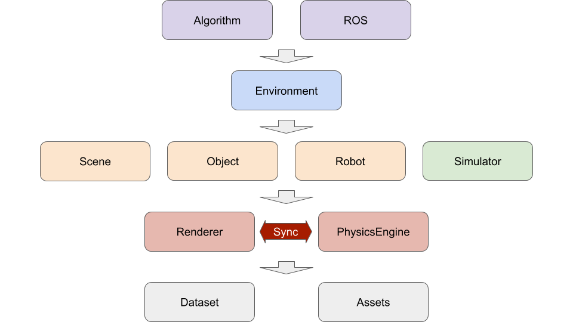

# Overview of Modules

Next, we will give an overview of iGibson and briefly explain the different modules in our system.

First of all, we have **Datasets** and **Assets**. 
**Datasets** include the 3D reconstructed real-world environments (iGibson Dataset), and 3D models of objects (BEHAVIOR Dataset of Objects). 
**Assets** contain models of robots and some additional 3D objects. 
The download guide for the assets can be found [here](installation.html#downloading-the-assets). 
More info can be found in the sections [Datasets](dataset.md) and [Assets](assets.md).

Next, we have **Renderer** and **PhysicsEngine**. 
These are the two pillars that ensure the visual and physics fidelity of iGibson. 
We developed our own renderer that supports customizable camera configuration, physics-based rendering (PBR) and various image modalities, and renders at a lightening speed. 
We use the open-sourced [PyBullet](http://www.pybullet.org/) as our underlying physics engine. 
It can simulate rigid body collision and joint actuation for robots and articulated objects in an accurate and efficient manner. 
Since we are using MeshRenderer for rendering and PyBullet for physics simulation, we need to keep them synchronized at all time. 
Our code have already handled this for you. More info can be found here: [Renderer](renderer.md).

Furthermore, we have **Scene**, **Object**, **Robot**, and **Simulator**. 
**Scene** loads 3D scene meshes from `igibson.g_dataset_path, igibson.ig_dataset_path` and loads/holds the list of objects associated with an interactive scene.
**Object** loads interactable objects from `igibson.assets_path`. 
**Robot** loads robots from `igibson.assets_path`. 
**Simulator** maintains an instance of **Renderer** and **PhysicsEngine** and provides APIs to import **Scene**, **Object** and **Robot** into both of them and keep them synchronized at all time. 
More info can be found here: [Scene](./scenes.md), [Object](./objects.md), [Robot](./robots.md), and [Simulator](simulators.md).

Moreover, we have **Task**, **Sensor** and **Environment**. 
**Task** defines the task setup and includes a list of **Reward Function** and **Termination Condition**. 
It also provides task-specific reset functions and task-relevant observation definition. 
**Sensor** provides a light wrapper around **Render** to retrieve sensory observation. 
**Environment** follows the [OpenAI gym](https://github.com/openai/gym) convention and provides an API interface for external applications. 
More info can be found here: [Environment](environments.md).

Finally, any learning framework (e.g. RL, IL) or planning and control framework (e.g. ROS) can be used with **Environment** as long as they accommodate the OpenAI gym interface. 
We provide tight integration with **ROS** that allows for evaluation and visualization of, say, ROS Navigation Stack, in iGibson. 
More info can be found here: [Learning Framework](learning_framework.md) and [ROS](ros_integration.md).

We highly recommend you go through each of the Modules below for more details and code examples.
