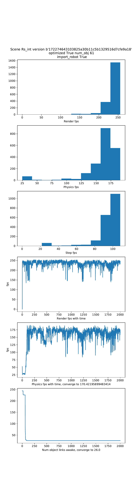

# Quickstart

## iGibson in Action
Let's assume you finished the installation and downloading some assets and datasets. Let's now get our hands dirty and see iGibson in action!

```bash
python -m igibson.examples.environments.env_nonint_example
```

If the execution fails with segfault 11, you may need to reduce texture scaling in the config file (igibson/configs/turtlebot_static_nav.yaml) to avoid out-of-memory error.

You should see something like this, but as default, you will only see the two small windows, without the PyBullet viewer.


The robot (TurtleBot) is moving around with random actions in a realistic house model called "Rs" that is automatically downloaded. The model is not interactive: objects won't move if the robot collides with them.

On the right side, you can see two windows from our mesh renderer. The top one (RobotView) shows the robot's first person view. The bottom one (ExternalView) shows the view of a virtual camera floating in the air.

The large window shows PyBullet visualization. This visualization is deactivated as default, you would need to explicitly activate it using the argument `use_pb_gui` of the **Environment**. 

If you want to have a virtual tour around the house yourself, you can click on the ExternalView window, and then translate the virtual camera to a different location by pressing "WASD" on your keyboard and rotate it to a different angle by dragging your mouse.

Enjoy!

Explore other examples by executing `python -m igibson.examples.XXXX`. Please, consider that some of the examples require to download the iGibson 1.0 or iGibson 2.0 datasets of scenes and/or the BEHAVIOR dataset of objects. See how to download them [here](dataset.md).

## Running iGibson via Docker
We provide pre-built Docker images via Docker Hub.

If you don't need to access the iGibson GUI:
```
docker run --gpus all -ti --rm igibson/igibson:latest /bin/bash
# run a non-GUI example after the container command line prompt shows:
python -m tests.benchmark.benchmark_static_scene
```

If you need to access the iGibson GUI and you are on a workstation running X11 server (e.g. most Linux desktops):
```
docker run --env="DISPLAY" --volume="/tmp/.X11-unix:/tmp/.X11-unix:rw" --env="QT_X11_NO_MITSHM=1" --gpus all -ti --rm igibson/igibson
# run a GUI example after the container command line prompt shows:
python -m igibson.examples.environments.env_nonint_example
```

If you need to access the iGibson GUI and you are on a headless node (e.g. a cloud server):
```
docker run --gpus all -ti --rm igibson/igibson-vnc:latest /bin/bash
# run a GUI example after the container command line prompt shows:
python -m igibson.examples.environments.env_nonint_example
``` 

On your local machine, you can use any VNC client to visit the remote GUI at `<remote-ip>:5900` with the default password `112358`. 

For example, Mac OS X provides a native app called [Screen Sharing](https://support.apple.com/guide/mac-help/share-the-screen-of-another-mac-mh14066/mac) that implements the VNC protocol.


## Measuring the performance of the simulator

Performance is a big designing focus for iGibson. We provide a few scripts to measure the performance of rendering and physics simulation in your target machine.

### Measuring the performance in static scene (Gibson scenes)
```bash
python -m tests.benchmark.benchmark_static_scene
```

You will see output similar to:
```
physics simulation + rendering rgb, resolution 512, render_to_tensor True: 421.12805140080695 fps
Rendering rgb, resolution 512, render_to_tensor True: 778.2959856272473 fps
Rendering 3d, resolution 512, render_to_tensor True: 857.2466839793148 fps
Rendering normal, resolution 512, render_to_tensor True: 878.6977946996199 fps

physics simulation + rendering rgb, resolution 512, render_to_tensor False: 205.68141718250024 fps
Rendering rgb, resolution 512, render_to_tensor False: 265.74379871537326 fps
Rendering 3d, resolution 512, render_to_tensor False: 292.0761459884919 fps
Rendering normal, resolution 512, render_to_tensor False: 265.70666134193806 fps

```

### Measuring the performance of the physics simulation in interactive scenes (iGibson scene)

```bash
python -m tests.benchmark.benchmark_interactive_scene
```

It will generate a report like below:




### Measuring the performance of rendering in interactive scenes

To run a comprehensive benchmark for all rendering in all iGibson scenes, you can excute the following command:

```bash
python -m tests.benchmark.benchmark_interactive_scene_rendering
```

It benchmarks two use cases, one for training visual RL agents (low resolution, shadow mapping off), another one for
 training perception tasks, with highest quality of graphics possible.
 
 ```python
 'VISUAL_RL': MeshRendererSettings(enable_pbr=True, enable_shadow=False, msaa=False, optimized=True),
 'PERCEPTION': MeshRendererSettings(env_texture_filename=hdr_texture,
                                    env_texture_filename2=hdr_texture2,
                                    env_texture_filename3=background_texture,
                                    light_modulation_map_filename=light_modulation_map_filename,
                                    enable_shadow=True, msaa=True,
                                    light_dimming_factor=1.0,
                                    optimized=True)

```
It will generate a report like below:


