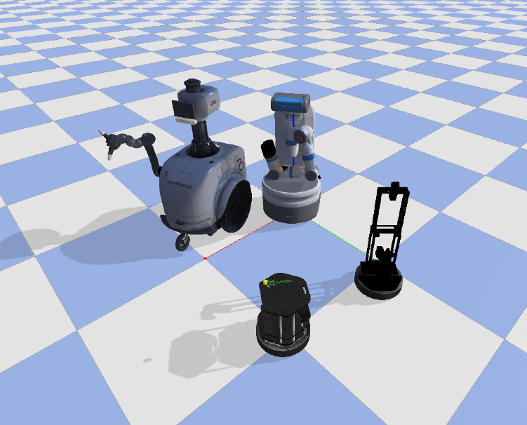

# Robots

### Overview
We provide a wide variety of **Robots** that can be imported into the **Simulator**.

| Agent Name     | DOF | Information      | Controller |
|:-------------: | :-------------: |:-------------: |:-------------|
| Mujoco Ant      | 8     | [OpenAI Link](https://blog.openai.com/roboschool/) | Torque |
| Mujoco Humanoid | 17    | [OpenAI Link](https://blog.openai.com/roboschool/) | Torque |
| Husky Robot     | 4     | [ROS](http://wiki.ros.org/Robots/Husky), [Manufacturer](https://www.clearpathrobotics.com/) | Torque, Velocity, Position |
| Minitaur Robot  | 8     | [Robot Page](https://www.ghostrobotics.io/copy-of-robots), [Manufacturer](https://www.ghostrobotics.io/) | Sine Controller |
| Quadrotor       | 6     | [Paper](https://repository.upenn.edu/cgi/viewcontent.cgi?referer=https://www.google.com/&httpsredir=1&article=1705&context=edissertations) | Torque |
| TurtleBot       | 2     | [ROS](http://wiki.ros.org/Robots/TurtleBot), [Manufacturer](https://www.turtlebot.com/) | Torque, Velocity, Position, Differential Drive |
| Freight         | 2     | [Fetch Robotics Link](https://fetchrobotics.com/robotics-platforms/freight-base/) | Torque, Velocity, Position, Differential Drive|
| Fetch           | 10    | [Fetch Robotics Link](https://fetchrobotics.com/robotics-platforms/freight-base/) | Torque, Velocity, Position, Differential Drive |
| JackRabbot      | 2 & 7 | [Stanford Project Link](http://cvgl.stanford.edu/projects/jackrabbot/) | Torque, Velocity, Position, Differential Drive |
| LocoBot         | 2     | [ROS](http://wiki.ros.org/locobot), [Manufacturer](https://www.trossenrobotics.com/locobot-pyrobot-ros-rover.aspx) | Torque, Velocity, Position, Differential Drive |

Typically, these robot classes take in the URDF file or MuJoCo XML file of an robot (in `igibson.assets_path`) and provide a `load` function that be invoked externally (usually by `import_robot` of `Simulator`). The `load` function imports the robot into PyBullet.

All robot clases inherit `LocomotorRobot`. Some useful functions are worth pointing out:
- `{get/set}_{position/orientation/rpy/linear_velocity/angular_velocity}`: get and set the physical states of the robot base
- `apply_robot_action`: set motor control for each of the controllable joints. It currently supports four modes of control: joint torque, velocity, position, and differential drive for two-wheeled robots
- `calc_state`: compute robot states that might be useful for external applications
- `robot_specific_reset`: reset the robot joint states to their default value, particularly useful for mobile manipulators. For instance, `Fetch.robot_specific_reset()` will reset the robot to be something like this:


Here are some details about how we perform motor control for robots:
- Say the robot uses joint velocity control `self.control == 'velocity'`
- We assume the external user (say an RL agent) will call `apply_action` with `policy_action` that is always between `-1` and `1`.
- `policy_action` will be scaled to `robot_action` by `policy_action_to_robot_action` based on the action space. The action space is set by `config['velocity']` in the YAML config file
- `robot_action` will be applied by `apply_robot_action`, which internally executes the following:
```python
def apply_robot_action(action):
    for n, j in enumerate(self.ordered_joints):
        j.set_motor_velocity(self.velocity_coef * j.max_velocity * float(np.clip(action[n], -1, +1)))
```
Note that `robot_action` is a normalized joint velocity, i.e. `robot_action[n] == 1.0` means executing the maximum joint velocity for the nth joint. The limits of joint position, velocity and torque are extracted from the URDF file of the robot.

Most of the code can be found here: [igibson/robots](https://github.com/StanfordVL/iGibson/blob/master/igibson/robots).

### BehaviorRobot
The BehaviorRobot can be used in VR as an avatar, or as an autonomous agent to participate in the BEHAVIOR100 challenge. The embodiment is composed of two hands, a torso, and a head link. It largely follows the convention of previous "URDF" based robots, but contains multiple URDFs connected by floating joints(constraints).

The BehaviorRobot has an action space of 26 DoF listed below.
- Torso: 6 DoF delta pose - relative to torso frame from the previous frame
- Head: 6 DoF delta pose - relative to torso frame (where the torso will be after applying this frame's action)
- Left hand, right hand (in this order): 6 DoF delta pose - relative to torso frame (where the torso will be after applying this frame's action)
- Grasping left hand, Grasping right hand (in this order): delta of change in the fraction of the grasping action (between 0=hand fully open, and 1=hand fully closed)

The reference frame of each body part is shown below.


### Examples
In this example, we import four different robots into PyBullet. We keep them still for around 10 seconds and then move them with small random actions for another 10 seconds. The code can be found here: [igibson/examples/demo/robot_example.py](https://github.com/StanfordVL/iGibson/blob/master/igibson/examples/demo/robot_example.py).

```python
from igibson.robots.locobot_robot import Locobot
from igibson.robots.turtlebot_robot import Turtlebot
from igibson.robots.jr2_kinova_robot import JR2_Kinova
from igibson.robots.fetch_robot import Fetch
from igibson.utils.utils import parse_config
import os
import time
import numpy as np
import pybullet as p
import pybullet_data
import igibson

def main():
    p.connect(p.GUI)
    p.setGravity(0, 0, -9.8)
    p.setTimeStep(1./240.)

    floor = os.path.join(pybullet_data.getDataPath(), "mjcf/ground_plane.xml")
    p.loadMJCF(floor)

    robots = []
    config = parse_config(os.path.join(igibson.example_config_path, 'fetch_reaching.yaml'))
    fetch = Fetch(config)
    robots.append(fetch)

    config = parse_config(os.path.join(igibson.example_config_path,'jr_reaching.yaml'))
    jr = JR2_Kinova(config)
    robots.append(jr)

    config = parse_config(os.path.join(igibson.example_config_path, 'locobot_point_nav.yaml'))
    locobot = Locobot(config)
    robots.append(locobot)

    config = parse_config(os.path.join(igibson.example_config_path, 'turtlebot_point_nav.yaml'))
    turtlebot = Turtlebot(config)
    robots.append(turtlebot)

    positions = [
        [0, 0, 0],
        [1, 0, 0],
        [0, 1, 0],
        [1, 1, 0]
    ]

    for robot, position in zip(robots, positions):
        robot.load()
        robot.set_position(position)
        robot.robot_specific_reset()
        robot.keep_still()

    for _ in range(2400):  # keep still for 10 seconds
        p.stepSimulation()
        time.sleep(1./240.)

    for _ in range(2400):  # move with small random actions for 10 seconds
        for robot, position in zip(robots, positions):
            action = np.random.uniform(-1, 1, robot.action_dim)
            robot.apply_action(action)
        p.stepSimulation()
        time.sleep(1./240.0)

    p.disconnect()


if __name__ == '__main__':
    main()
```
The four robots will have a fun cocktail party like this:



