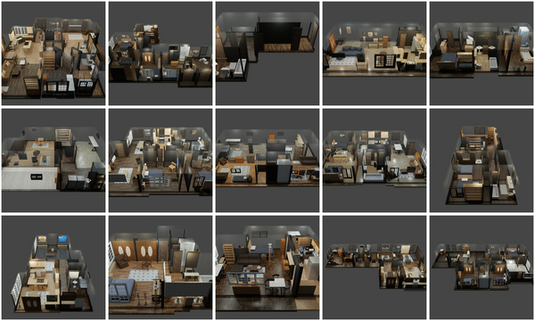

# iG Dataset Content Description

The iG Dataset v1.0 includes:

**15 large scenes (100+ rooms):**



- Scenes are the result of converting 3D reconstructions of real homes into fully interactive simulatable environments. 
- Each scene corresponds to one floor of a real world home. 
- The scenes are annotated with bounding box location and size of different objects, mostly furniture, e.g. cabinets, doors, stoves, tables, chairs, beds, showers, toilets, sinks...
- Scenes include layout information (occupancy, semantics)
- Each scene's lighting effect is designed manually, and the texture of the building elements (walls, floors, ceilings) is baked offline with high-performant ray-tracing
- Scenes are defined in iGSDF (iGibson Scene Definition Format), an extension of URDF, and shapes are OBJ files with associated materials

**More than 500 object models:**
- The models have been collected from open source datasets (shapenet, partnet-mobility dataset...).
- The models have been cleaned up (normals, small errors) and annotated with physics-based material information (diffuse, roughness, metallic, normal) and dynamics properties (weight, friction)
- Objects with articulation can move, thanks to the partnet-mobility dataset annotation
- Object models are defined as URDFs and shapes are OBJ files with associated materials

We acknowledge [shapenet](https://www.shapenet.org/) and [partnet-mobility dataset](https://sapien.ucsd.edu/browse) for their contributions. If you use the iG Dataset in your research, please consider also citing them.

Below, we describe:
1. **data format** for both [scene](#igibson-scene-data-format) and [object](#igibson-object-data-format).
2. how to **customize your own scene** by adding more iGibson objects to an existing iGibson scene.

We also include instruction to **import data from external sources** :
1. [instructions](ext_object) on how to import your own objects to iGibson.
2. [instructions](ext_scene) on how to import scenes from existing datasets ([CubiCasa5k](https://github.com/CubiCasa/CubiCasa5k) and [3D-FRONT](https://tianchi.aliyun.com/specials/promotion/alibaba-3d-scene-dataset)) to iGibson.

## iGibson scene data format

```
scene_name
│
└───urdf
│   │   # The structure of links (in iGSDF pseudo-URDF format) and joints
│   │   scene_name.urdf
│   │   # Single link object with all the walls (collision and visual)
│   │   scene_name_walls.urdf
│   │   # Single link object with all the floors (collision and visual)
│   │   scene_name_floors.urdf
│   │   # Single link object with all the ceilings (collision and visual)
│   │   scene_name_ceilings.urdf
│   │   # multi-link object with each building structure as a link, used to generate scene_name{_best|_random_N}.urdf
│   │   scene_name_orig.urdf
│   │   # Similar to scene_name.urdf, but has object instances already selected, with the highest quality geometry and material, and guaranteed scene consistency.
│   │   scene_name_best.urdf
│   │   # Similar to scene_name.urdf, but has object instances already selected, with the highest quality geometry and material, and guaranteed scene consistency. Used for object randomization.
│   │   scene_name_random_N.urdf
│
└───shape
│   └───visual
│   │   │   # Directory containing all the obj files for walls and floors. 
│   │   │   # Each obj uses a different baked texture map, linked by the corresponding mtl file. 
│   │   │   wall_vm.obj, wall.mtl
│   │   │   ceiling_vm.obj, ceiling.mtl
│   │   │   floor_0_vm.obj, floor_0.mtl
│   │   │   floor_1_vm.obj, floor_1.mtl
│   │   │   ...
│   │ 
│   └───collision
│   │   │   # Directory containing all the collision obj files for walls and floors. 
│   │   │   wall_cm.obj
│   │   │   ceiling_cm.obj
│   │   │   floor_0_cm.obj
│   │   │   Floor_1_cm.obj
│   │   │   ...
│   │ 
└───material
│   │   # Each directory contains the corresponding structure element’s baked texture map. 
│   │   # There are two channels: COMBINED.png (RGB map with baked shading) and NORMAL.png (tangent normal map).
│   └───ceiling
│   │   │   COMBINED.png
│   │   │   NORMAL.png
│   │ 
│   └───wall
│   │   │   COMBINED.png
│   │   │   NORMAL.png
│   │ 
│   └───floor_0
│   │   │   COMBINED.png
│   │   │   NORMAL.png
│   │ 
│   └───floor_1
│   │   ...
│
└───layout
│   │   # All maps have the same center and orientation. Each pixel represents a centimeter in 3D space.
│   │   #
│   │   # obstacle map for localization and planning, contains only structure elements
│   │   floor_no_obj_0.png
│   │   # obstacle map for localization and planning, contains all furnitures
│   │   floor_0.png
│   │   # occupancy map for localization and planning, contains only structure elements
│   │   floor_trav_no_obj_0.png
│   │   # occupancy map for localization and planning, contains all furnitures
│   │   floor_trav_0.png
│   │   # scene semantic segmentation map for initialization (objects, agents) and other perceptual tasks
│   │   floor_semseg_0.png
│   │   # scene instance segmentation map for initialization (objects, agents) and other perceptual tasks
│   │   floor_insseg_0.png
│   │   # lighting type map used for iGibson rendering
│   │   floor_lighttype_0.png
│ 
└───misc
│   │  # Stores all the objects in the scene, used to generate scene_name.urdf, scene_name_best.urdf and scene_name_random_N.urdf
│   │   all_objs.json
│   │   # A list of object pairs that have overlapping bounding boxes, used for scene quality check
│   │   bbox_overlap.json
│   │   # Material group that the ceilings are assigned to, used for online texture randomization
│   │   ceilings_material_groups.json
│   │   # Similar to above
│   │   floors_material_groups.json
│   │   # Similar to above
│   │   walls_material_groups.json
│   │   # Annotated camera trajectory that tour through each scene 
│   │   tour_cam_trajectory.txt 
```

## iGibson object data format

```
OBJECT_NAME
│   # Unified Robot Description Format (URDF)
│   # http://wiki.ros.org/urdf
│   # It defines the object model (parts, articulation, dynamics properties etc.).
│   OBJECT_NAME.urdf 
│
└───shape
│   └───visual 
│   │    │   # Directory containing visual meshes (vm) of the object. Used for iGibson's rendering
│   │    │   # All objs are UV mapped onto the same texture, linked by default.mtl. All faces are triangles.
│   │    │   # Each obj represents a unique (link, material) combination.
│   │    │   # For example, link_1_m1_vm.obj represents the part of link_1 that uses material m1. 
│   │    │   # The material annotation can be found in OBJECT_NAME/misc/material_groups.json.
│   │    │  link_1_m1_vm.obj
│   │    │  link_1_m2_vm.obj
│   │    │  link_2_m1_vm.obj
│   │    │  …
│   │    │  default.mtl (links the geometry to the texture files)
│   │ 
│   └───collision
│   │    │   # Directory containing collision meshes (cm) of the objects. Used for iGibson's physics simulation.
│   │    │   # Each obj represents a unique link of the object.
│   │    │   # For example, link_1_cm.obj represents the collision mesh of link_1. 
│   │    │  link_1_cm.obj
│   │    │  link_2_cm.obj
│   │    │  …
│
└───material
│   │   # There are 4 channels:
│   │   # 	DIFFUSE.png (RGB albedo map)
│   │   # 	METALLIC.png (metallic map)
│   │   # 	NORMAL.png (tangent normal map)
│   │   # 	ROUGHNESS.png (roughness map)
│   │   DIFFUSE.png
│   │   METALLIC.png	
│   │   NORMAL.png
│   │   ROUGHNESS.png
│
└───misc
│   │   # contains bounding box information of the object
│   │   metadata.json
│   │   # contains the object’s material annotation of what kinds of material each link can have.
│   │   material_groups.json 
│
└───visualizations
│   │   # GIF of the visual mesh of the object rotating, rendered with iG renderer
│   │   OBJECT_NAME.gif
```
