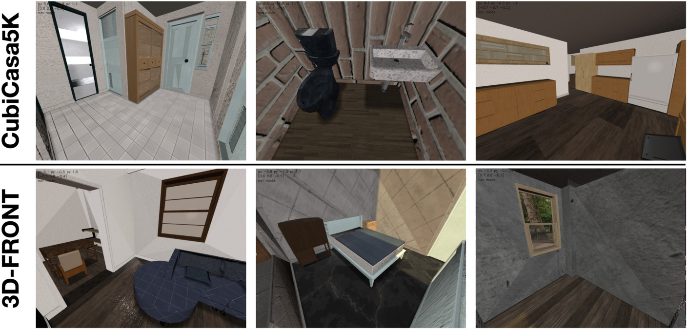

# Import an scene into iGibson

To use external scenes in iGibson, it needs be converted to the scene format described here: [data format](../README.md).

Here we provide an automated pipeline to execute this conversion from:
1. [CubiCasa5k](https://github.com/CubiCasa/CubiCasa5k): A Dataset and an Improved Multi-Task Model for Floorplan Image Analysis. (Kalervo, Ahti, et al.)
2. [3D-FRONT](https://tianchi.aliyun.com/specials/promotion/alibaba-3d-scene-dataset): 3D Furnished Rooms with layOuts and semaNTics. (Fu, Huanl, et al.)
by running a provided script. This script makes use of the software Blender, which needs to be installed first. You won't need to use blender directly, as the script calls it automatically.

The example script executes the following steps
- Preprocess scene data from CubiCasa5k or 3D-FRONT into scene components.
- Generate the visual and collision meshes of the walls, floors and ceiling of the scene. Generate the bounding box annotations of the objects in scene. Generate the base scene URDFs.
- Generate the iGSDF (iGibson Scene Definition Format), an extension of URDF, for the scene. Generate travserability map.



Above shows some example scenes from CubiCasa5K (first row) and 3D-Front(second row).

**Important Note:** CubiCasa5K and 3D-Front scenes have much less objects per scene (<40) on average than those of iGibson (75).  

We currently only offer support for Linux.

## Installing Blender

We use Blender 2.82 for mesh processing. Follow the instruction here: [blender_utils](../blender_utils/) for guide on installation.

## Process external scenes

First, you need to download some helper assets for external scenes, which can be done by simply running:
```
python -m igibson.utils.assets_utils --download_ext_scene_assets
```
This will download some default materials, as well as 3D-Front's no-collision URDFs (explained more in details in section [3D-Front)](#important:-addressing-overlapping-bounding-boxes-in-3d-front).

### Process a CubiCasa5K scene

To preprocess a CubiCasa5K scene, please follow these steps:
1. Please follow CubiCasa5K's instruction [here](https://github.com/CubiCasa/CubiCasa5k#dataset) and download the data. After unzipping, the folder (let's call it ```CUBICASA_ROOT```) should contain:
```
colorful  high_quality  high_quality_architectural  test.txt  train.txt  val.txt
``` 

2. Each folder of ```CUBICASA_ROOT/*/* ``` represent the floor plan of a real-world home. We will convert each floor of the home into an iGibson scene, which can be easily done by one command:
```
./scripts/process_scene_cubicasa.sh CUBICASA_ROOT/x/x
```
replace ```CUBICASA_ROOT/x/x``` with the real path.

3. To convert all CubiCasa5K scenes, you can run:
```
for s in CUBICASA_ROOT/*/*; do;  ./scripts/process_scene_cubicasa.sh $s; done
```
replace ```CUBICASA_ROOT``` with the real path. Note that this process can take  multiple hours.

We make the following changes to CubiCasa5K scenes during our processing:
1. We skip objects that are not in our dataset (e.g. Fireplace). We also skip objects that have unclear category label (e.g. GeneralAppliance).
2. For objects that have overlapping bounding boxes, we try to shrink the bounding boxes by no more than 20%. We sort all objects by how many other objects the object overlaps with. We iteratively go through the list, if shrinking doesn't resolve the issue, we delete that object.

Notes:
1. CubiCasa5k are floorplans of fixed furnitures only (e.g. stove, wall cabinet, fridge etc.). 
2. Object and scene category mappings can be found [here](scripts/utils/semantics.py) .

### Process a 3D-FRONT scene

To import a 3D-Front scene into iGibson, please follow the these steps:
1. Please follow 3D-Front's instruction [here](https://tianchi.aliyun.com/specials/promotion/alibaba-3d-scene-dataset#download) and download the data. After unzipping, the folder (let's call it ```THREEDFRONT_ROOT```) should contain 10k *.json* files.
2. Each file in ```THREEDFRONT_ROOT``` represent a online-designed apartment. We will convert each apartment into an iGibson scene, which can be easily done by one command:
```
./scripts/process_scene_3dfront.sh THREEDFRONT_ROOT/x
```
replace ```THREEDFRONT_ROOT/x``` with the real path of any json file.

3. To convert all 3D-Front scenes, you can run:
```
for s in THREEDFRONT_ROOT/*; do;  ./scripts/process_scene_3dfront.sh $s; done
```
replace ```THREEDFRONT_ROOT``` with the real path. Note that this process can take multiple hours.

We make the following changes to 3D-Front scenes during our processing:
1. We skip scenes that contain unclear category label as part of the scene mesh:
```
[ 'CustomizedFixedFurniture', 'CustomizedFurniture', 'CustomizedPersonalizedModel', 'CustomizedPlatform']
```
since we can't generate collision meshes properly with these categories. In total, there are 8808 scenes that don't contain any of the category above.
 2. 3D-Front also has known corrupted mesh issue (see [github issue](https://github.com/3D-FRONT-FUTURE/3D-FRONT-ToolBox/issues/2#issuecomment-682678930)). We expect this problem to be solved in future releases of 3D-Front.
3. the kitchen cabinets in 3D-Front are not annotated as objects, but instead the entire kitchen furniture is a single object with each panel of the furniture represented as separate meshes. This impedes us to generate interactive versions of the kitchen cabinets. We include two alternative versions of the scenes: a) a version with non-interactive kitchen cabinets, and b) a version without any kitchen cabinets. We expect this problem to be solved in future annotations of 3D-Front.
 
Notes:
1.  Object and scene category mappings can be found [here](scripts/utils/semantics.py) .

#### Important: addressing overlapping bounding boxes in 3D-FRONT

While 3D-Front dataset includes a layout description of rooms and elements, including their position and size, the furniture pieces are sometimes defined as overlapping significantly with each other (see reported issue [here](https://github.com/3D-FRONT-FUTURE/3D-FRONT-ToolBox/issues/4)). This has a severe effect in our physics simulation as it tries to solve the penetrating contact. To alleviate this issue, we remove objects that overlap more than 80% of volume with others. 

At the same time, real-world free-moving objects can have overlapping bounding boxes (e.g. a chair tucked into a table), thus, for overlapping bounding boxes, we do the following:
- if two objects overlap with each other, we try to shrink the bounding boxes. We shrink by no more than 80%.
- we randomize the objects with our object assets, and try to come up with no-collision object configurations from overlapping bounding boxes. 

We managed to provide no-collision URDFs for 6049 scenes.  If the scene your are converting is among this set, the scene generation process will automatically retrieve the no-collision URDF. If not, **please use the scene at your own discretion**, since the objects might be penetrating with each other.


### Examine generated scenes

To examine the scene, you can leverage the ```mouse_interaction.py``` in iGibson's ```example/demo``` folder [igibson/examples/demo/mouse_interaction.py](https://github.com/StanfordVL/iGibson/blob/master/igibson/examples/demo/mouse_interaction.py). 

For Cubicasa5K, you can examine a scene by running:
```
python mouse_interaction.py --source CUBICASA -- scene $SCENE_ID
```
Here ```$SCENE_ID``` can be ```10709_floor_0``` or ```10709_floor_1``` if you converted scene ```colorful/10709``` in Cubicasa5k.

Similarly, for 3D-Front, you can examine a scene by running:
```
python mouse_interaction.py --source THREEDFRONT -- scene $SCENE_ID
```
Here ```$SCENE_ID``` is ````d8f50afc-d93f-49f8-9170-b7b9fe880152``` if you converted scene ```d8f50afc-d93f-49f8-9170-b7b9fe880152.json``` in 3D-Front.

